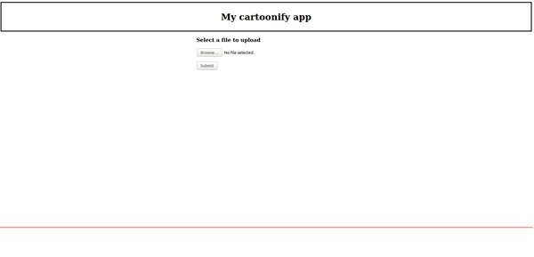

# My cartoonify app

## Description
This is a web app that runs in flask containerized in a docker image to be deployed in a cloud service.

It uses the [Cartoon GAN model](https://openaccess.thecvf.com/content_cvpr_2018/papers/Chen_CartoonGAN_Generative_Adversarial_CVPR_2018_paper.pdf) to generate manga like images in the style of Hosoda from input images.  

&nbsp;

## TODO: Deployment

https://medium.com/techfront/step-by-step-visual-guide-on-deploying-a-flask-application-on-aws-ec2-8e3e8b82c4f7

https://acloudguru.com/blog/engineering/deploying-a-containerized-flask-application-with-aws-ecs-and-docker